# Keep Riding

## Table of Contents

* [Purpose](#purpose)
* [UX](#ux)
  * [User Stories](#user-stories)
    * [First Time Visitor Goals](#first-time-visitor-goals)
    * [Returning Visitor Goals](#returning-visitor-goals)
    * [Frequent User Goals](#frequent-user-goals)
  * [Strategy](#strategy)
    * [Business Goals](#business-goals)
    * [User Goals](#user-goals)
  * [Scope](#scope)
  * [Structure](#structure)
    * [Wireframes Home](#wireframes-home)
    * [Wireframes Prices](#wireframes-prices)
    * [Wireframes Contact](#wireframes-contact)
    * [Wireframes Comments](#wireframes-comments)
  * [Skeleton](#skeleton)
    * [Colours](#colours)
    * [Typography](#typography)
    * [Imagery](#imagery)
  * [Surface](#surface)
* [Features](#features)
    * [Existing Features](#existing-features)
    * [Features Left to Implement](#features-left-to-inplement)
* [Technologies Used](#technologies-used)
* [Testing](#testing)
  * [Headers and Footers](#headers-and-footers)
  * [Home Section](#home-section)
  * [Prices Section](#prices-section)
  * [Contact Section](#contact-section)
  * [Online Validation](#online-validation)
  * [Meets User Needs](#meets-user-needs)
  * [Fixed Bugs](#fixed-bugs)
    * [Navigation Bar Colours](#navigation-bar-colours)
    * [Collapsible Hamburger Menu](#collapsible-hamburger-menu)
    * [Carousel Images](#carousel-images)
    * [Form Fieldset](#form-fieldset)
    * [Minor Fixes](#minor-fixes)
* [Deployment](#deployment)
* [Credits](#credits)
  * [Code](#code)
  * [Content](#content)
  * [Media](#media)
  * [Acknowledgments](#acknowledgments)

## Purpose

[Link to live project.](https://mayasharma2110.github.io/Keep-Riding/)

This is a website for a fictional horse riding school.  

It is aimed for those who are interested in taking up horse riding or those with previous experience who wish to improve thier skills.
The riding school is for those of any age, gender or ability. 

## UX

### User Stories

#### First Time Visitor Goals

* As a first time user, I want to understand the purpose of the website and learn about the riding school.

* As a first time user, I want to be able to navigate through the site easily.

* As a first time user, I want to be able to view the website on a laptop, tablet or phone and I want the content to be displayed well on any device.

* As a first time user, I want to see what facilites are offered by the riding school.

#### Returning Visitor Goals

* As a returning user, I want to check the range of lessons that are offered and the prices. 

* As a returning user, I want to read reviews from current and previous customers about this school.

* As a returning user, I want to contact the school to book a lesson and/or ask for additional information.

* As a returning user, I want to find out where I can follow the riding school on social media platforms.

#### Frequent User Goals

* As a frequent user, I want to check the lessons that are offered.

* As a frequent user, I want to check the cost of the lessons offered and see if there are any special offers.

### Strategy

#### Business goals

* Increase interaction with potential new customers.

* Increase presence and following on social media platforms including facebook and instagram.

* Increase the number of lessons/hacks booked.

#### User Goals

* To see what the school offers in terms of facilites, lessons and prices.

* To be able to contact the school to ask for more information or book.

* To be able to see some pictures of the horses and riding.

* For the school to offer private and small groups lessons, so they can improve quicker.

* For the school to have an indoor and outdoor areana(s), so that you can ride in any weather conditions.

* For the school to offer hacks for a more relaxed riding experience.

### Scope

Key features to be included based on user stories are:

* Responsive website on mobile, tablet and laptop size devices.

* Interactive elements: 
  * Navbar becomes a burger menu on mobile, also hovering over elements (in navigation bar and footer) gives a colour change.
  * On the home page there is a carousel where users can scroll through some picutres.

* About Us - allows users to find out who we are and what we do by having them read a short paragraph.

* Facilities - allows users to find out what specific services we can provide and the facilities we have, by reading a list.

* Reviews - allows users to find out how other customers have enjoyed our services, by providing reviews from previous and current customers.

* Prices - allows users to find out what specific lessons are offered and at what cost, by providing the information in a table format.

* Contact/Booking Form - allows users to contact the school if they wish to book a service or ask for extra information. 

* Footer with links to social media accounts - allows the users to keep up to date with the school by following on social media.

### Structure

All pages of the webiste will have a consistent navigaton bar - which collapses when viewed on a small screen.

All pages of the webiste will have a footer with links to the social media accounts that users can view and follow to keep up to date with the company.

The website will use bootstrap grids to make the layout responsive to different devices and screen sizes.

The home page will contain an about us section explaining the goals of the riding school.

The home page will contain a facilities section explaining what the riding school has to offer and what makes it special from competitors.

The home page will contain a reviews section showing how other customers have enjoyed their time at the riding school.

The website will comtain a prices section which shows the lessons offered and their prices, including any special offers.

The website will comtain a contact section which alows users to get in touch with the school to request more information or book a lesson.

### Skeleton

I used Balsamiq to make the wireframes for this project. The website was designed to have 3 pages - home, prices and contact.
The wireframes were created for all pages for phone, tablet and desktop devices.

#### Wireframes Home

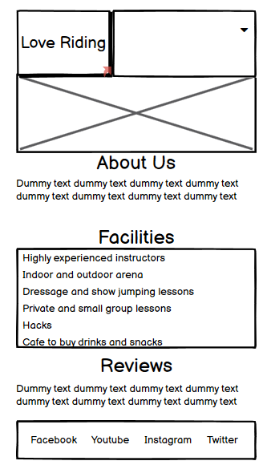  
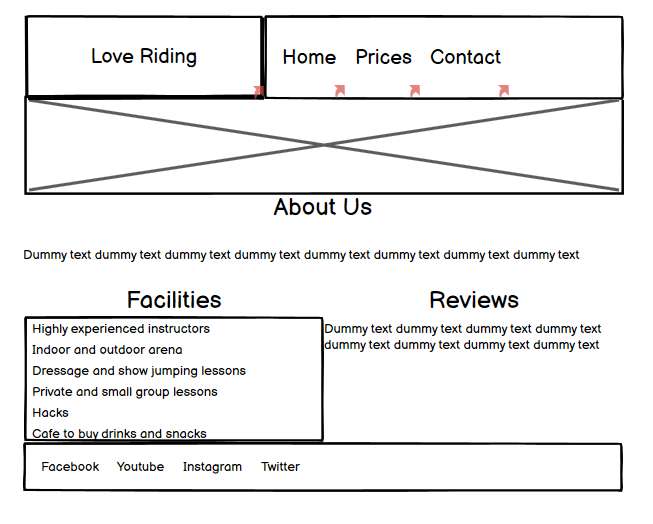  
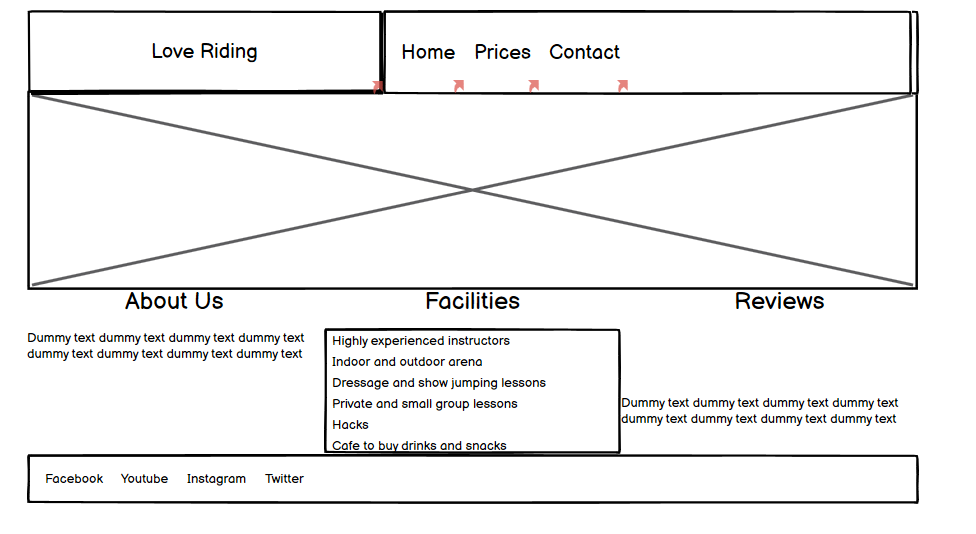  

#### Wireframes Prices

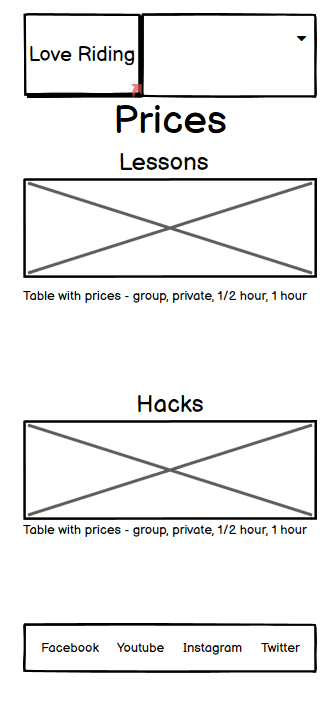  
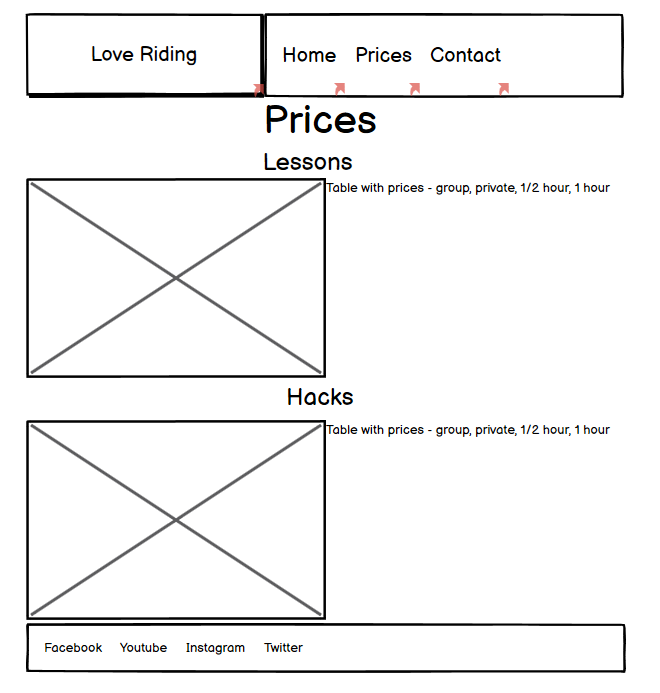  
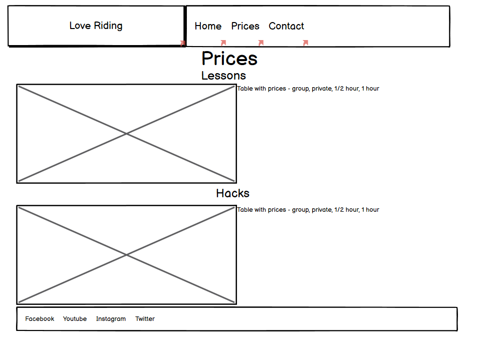 

#### Wireframes Contact

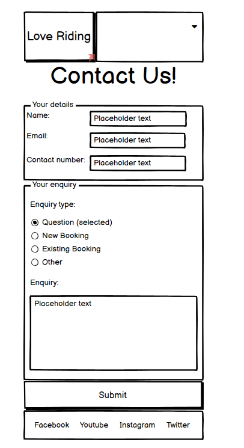  
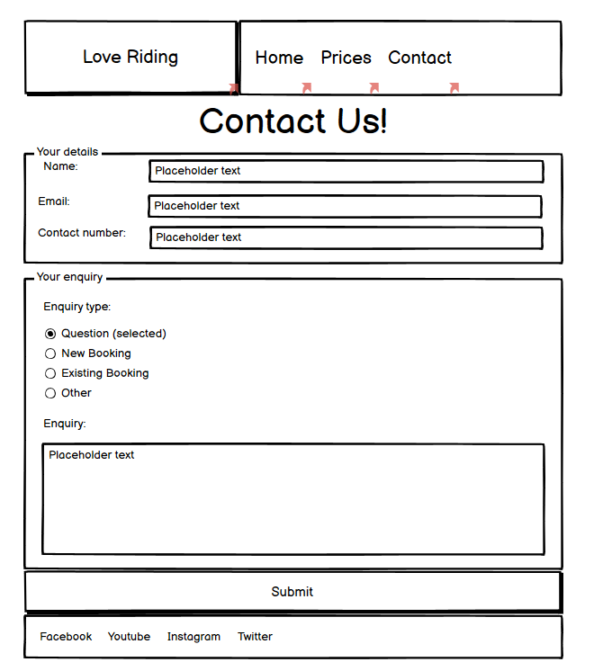  
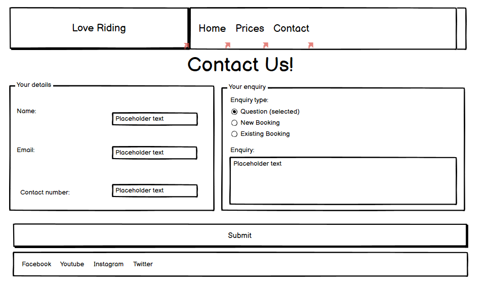  

The full wireframes can be found [here](assets/wireframes/Keep_Riding_Wireframes.bmpr).

#### Wireframes Comments

Please not there are a few changes to the site since the wireframes were made:

* Margins and padding were not included in the wireframes.

* Home page: A carousel of images is displayed instead of a single image.
This was added as it fufils the user need to view several pictures of horses, and removed the need for a separate gallery page.

* Home page: The desktop wireframe has all 3 sections side by side. 
Once the margins and specific text was added this view did not look ideal, 
so it was kept the same as the tablet layout.

* Prices page: I added a special offers section similar to that of lessons/hacks.
This was added as it increases the chance of returning/frequent users booking a block of lessons instead of just one at a time.
It also helps the user save some money and for the business it
increases the chances of returning/frequent users continuing to use this school in the future.
This is also a feature that most riding schools offer as the sport/hobby is costly for regular riders.

* For the contact page a background image and some information on opening times was added.
This was because once the form was added the page looked a bit bare when viewed on a desktop.
It also provides the user with information on when the school is open, helping them decide if this school aligns well with their own schedule.

* For the contact page a background image to the form was added. 
This was added as the user wants to see picures of horses throughout the site where possible.

### Surface

#### Colours

The two main colours used in the website are yellow (palegoldenrod) and brown (saddlebrown).
I picked these colours because I wanted the colour theme to match that of horse riding (brown/beige).

However, I did not want the website to feel dull or bland so I made some elements turn blue (#0c0cff) when the user hovers over them.  
I also picked picutres with some brighter colours in them, where possible, to help make the website more pleasing to the eye.

I used darkslategrey and whitesmoke colours for most of the text colour and saddlebrown for headings.

#### Typography

The two fonts used are from google fonts these are Roboto Slab for the headings and Montserrat for the body. 

#### Imagery

I found some images from the internet and further information can be found in the credits section.

## Features

### Existing Features

* Responsive on mobile, tablet and laptop size devices.
* Interactive elements:
  * Navbar becomes a burger menu on mobile, also hovering over elements (in navigation bar and footer) gives a colour change.
  * Carousel for user to scroll through photos of horses and horse riding in action.

* About Us - allows users to find out who we are and what we do by having them read a short paragraph.

* Facilities - allows users to find out what specific services we can provide and the facilities we have, by reading a list.

* Reviews - allows users to find out how other customers have enjoyed our services, by providing reviews from previous and current customers.

* Prices - allows users to find out what specific lessons are offered and at what cost, by providing the information in a table format.

* Contact/Booking Form - allows users to contact the school if they wish to book a service or ask for extra information. 

### Features Left to Implement

* It would be nice to add a gallery of the horses at the school with a brief description of each.

## Technologies Used

* HTML - used to create the main content for the website.

* CSS - used to add style and colour to the content.

* [Bootstrap Version 4.1.3](https://getbootstrap.com/docs/4.1/getting-started/download/)
  * Used grid layout to ensure the content was responsive to different device sizes (mobile, tablet and laptop).
  * Used to that the navbar could collpase when viewed on small screens but expand on medium and larger size screens.
  * Used to create the carousel of images on the home page.

* [Gitpod](https://www.gitpod.io/) - used to write the code for the website.

* [Github](https://github.com/) - used to store the current and previous versions of the code. It was also used to host the live website through github pages. 

* [Google Fonts](https://fonts.google.com/) - used to import the Roboto Slab and Montserrat font families that are used throught the website.

* [Font Awesome](https://fontawesome.com/) - used to display the social media icons in the footer of each page.

* [Balsamiq Wireframes](https://balsamiq.com/wireframes/) - used to create the wireframes for the website.

* [Tinypng](https://tinypng.com/) - used to compress the images so they loaded quicker on the website.

* [Am I Responsive](http://ami.responsivedesign.is/#) - used for the mockups of the website on different devices.

## Testing

### Headers and Footers

* Checked the links in navigation bar and footer worked. 

* Checked the navigation bar showed the user what page they were on with a bottom border.

* Checked the navbar is responsive - collapses on small screens and expands on medium and larger size screens.

* Checked the links in the navigation bar change colour and become bold when you hover over them. 

* Checked the links in the footer change colour when you hover over them.

### Home Section

* Checked the carousel is responsive and changes image automatically.  
I also checked the controls and indicators work as expected to allow the user to view a specific image. 

* Checked the elements are reponsive to different size devices.

### Prices Section

* Checked the elements are reponsive to different size devices.

* Checked there was a bottom margin between picture and tables when viewed on small device and right margin when viewed on medium and larger devices due to the change in layout.

* Checked the images look good when viewed on different screen sizes.

### Contact Section

* Checked the contact-img is responsive and changes in height on different devices.

* Checked the contact-img positioning is responsive when viewed on different devices.

* Checked the form makes a user enter all text fields (name, email, phone number), 
tick one of the radio box options, select an experience/ability level 
and also enter some text in the enquiry textarea.

* Checked the form only takes a email with a @ in the field.

* Checked the form is responsive to different size devices. 
  * The label, input and textarea widths change based on the device the website is viewed on.
  * The width and left/right margins change based on the device the website is viewed on.
  * The positioning of the background image changes based on the device the website is viewed on.

* Checked the submit button changes colour and background colour when you hover over it.

* Checked the reset button changes colour and background colour when you hover over it.

### Online Validation

* I checked the website loads and responds as expected on google chrome, microsoft edge and internet explorer browsers.  
I specifically checked the navbar and carousel work as expected on these browsers also.

* Used chrome developer tools and [responsinator](https://www.responsinator.com/) to check responsiveness on mobile, tablet and laptop devices.  
I also checked the website on my 15 inch laptop, 20 inch monitor and sony smartphone.

* Used the [w3c validator](validator.w3.org) to validate my html and css code and to check for no errors or warnings. 

* Used [lighthouse](https://developers.google.com/web/tools/lighthouse) in chrome developer tools to check the websites performance in terms of 
performance, accessibility, best practises and SEO.
This was done for all 3 pages of the website and for both mobile and desktop devices.
  * Home Mobile: Performance: , Accessibility: , Best Practises: , SEO: . Full report can be found [here]((assets/home-mobile.html)).
  * Home Desktop: Performance: , Accessibility: , Best Practises: , SEO: . Full report can be found [here]((assets/home-mobile.html)). 
  * Prices Mobile: Performance: , Accessibility: , Best Practises: , SEO: . Full report can be found [here]((assets/home-mobile.html)).
  * Prices Desktop: Performance: , Accessibility: , Best Practises: , SEO: . Full report can be found [here]((assets/home-mobile.html)).
  * Contact Mobile: Performance: , Accessibility: , Best Practises: , SEO: . Full report can be found [here]((assets/home-mobile.html)).
  * Contact Desktop: Performance: , Accessibility: , Best Practises: , SEO: . Full report can be found [here]((assets/home-mobile.html)).

### Meets User Needs

TO FILL IN SECTION.

### Fixed Bugs

#### Navigation Bar Colours

In the navigation bar the active page text was not showing as the correct colour (saddlebrown).
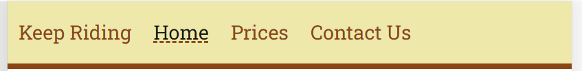
I discovered the problem using chrome developer tools to find the css selector of the problem text.  
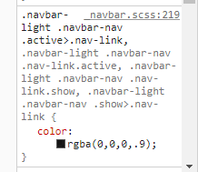

#### Collapsible Hamburger Menu

When the hamburger menu was opened on a small screen I wanted the naviagtional items to have smaller text and less padding.
I also did not want the underline to be shown on the active page in this circumstance.

From looking in chrome developer tools I noticed the change in the classes of the div element (highlighted below) 
from "collapse" to "collapsing" to "collapse show".
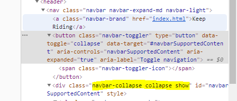

Therefore I thought I could target the below css selectors. 

> .navbar-light .show .navbar-nav .nav-link, .navbar-light .collapsing .navbar-nav .nav-link  

However the div has "collapse show" classes when viewed on a larger device and not just when the navbar becomes a hamburger menu.
I targeted the above elements within a media query to solve this.

#### Carousel Images

For the carousel the images I picked had different aspect ratios, 
and this caused the overall height of the element to change every few seconds which was not pleasant to view 
as the below elements also changed position due to the carousel.  

I resolved this by making sure all the images had the same aspect ratio using cropping.

#### Form Fieldset

I made the fieldset height to be 100% so that they looked better on larger screens when these are set side by side.  

However this made the height of the parent element (div with class “col-12 col-lg-6” in my case) smaller 
than that of fieldset height, which was unexpected.  This also caused issues with the submit and reset button 
positioning and making them inside the fieldset in some situations.

I tried experiementing with different height values for fieldset and its parent div which did not solve the 
problem and then I googled and found this [stackoverflow post](https://stackoverflow.com/questions/9116689/fieldset-does-not-follow-its-parents-height
) and from the post some [runnable example that explains my problem clearly ](http://jsfiddle.net/3hfytpw4/).  

Running the example demontrates the problem clearly (images below) you can see that the parent 
does not have the height which aligns with that of the fieldsets.

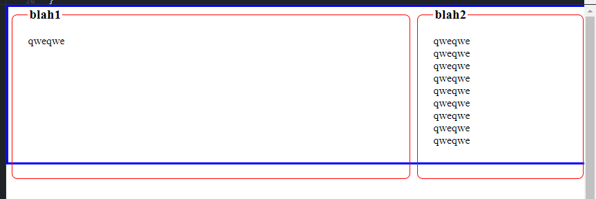
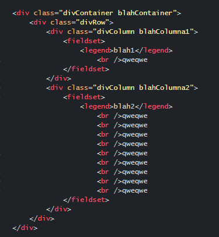
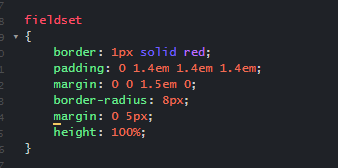

After some trial and error I found that commenting out the padding and margins in the css resulted in the below
desired result:
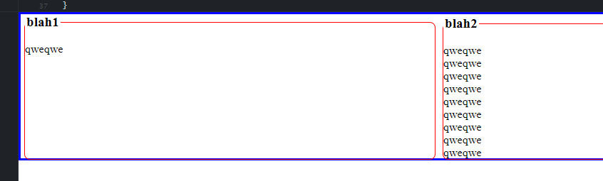

I removed the top/bottom padding and margins of fieldset and added these instead to the parent/child elements 
of fieldset. Note: The left/right padding and margins did not seem to cause any problems. Perhaps there is a more elegant solution to what I used but this worked fine for my needs, although a bit cumbersome.

#### Minor Fixes

* For the carousel I added a 4th indicator by adding an extra list iten to the carousel-indicators ordered list.

* In the prices section I had the images with a width of 100% as inline text, I discovered this error through the  [validator w3c](https://validator.w3.org/).
I removed this from the html and instead targeted these elements in the css file.

* For the text on the contact-img this was hard to pick a suitable colour for the text as the picutre
has many colours.  
I added an black transparent overlay so that the white text could be seen easier.

* For the contact form I added a black transparent overlay similar to above so the white test was easier to read 
where the image had a lighter green colour.  
However this made the heading, submit and reset buttons look faded out due to the overlay.  
I added the position relative to these elements to solve the issue.

* In the form I wanted the fieldset dotted line to go around the whole element.  
Due to bootstrap the fieldset legend width was set to 100%, discovered from chrome developer tools,
I added a width of auto to the element to solve the problem.

* In the form I made the textarea cols responsive by adding a width of 100% to the element.

* In the form I had set my labels for contact form to have a width of 40%, 
however my label "What is your experience/ability?" was greater than 40% width on some screen sizes causing a truncation issue.  
I changed the property to have a min-width of 40% instead which fixed the problem.

## Deployment

TO FILL IN SECTION.

## Credits

### Code

* The bootstrap library was used to help make this website responsive for different devices. 

* Bootstrap also allowed me to create an dropdown navigation bar for smaller devices and the carousel on the home page.  
I could not have added these features without bootstrap as I currently do not have knowledge of Javascript.

### Content

* I gained inspiration for the layout of the website by looking at other horse riding websites 
including [Hall Place Equestrian Centre](https://hall-place.com/) and [Palmers Riding Stables](http://palmers-stables.com/). 

* The above websites were also helped me with what content to put in the 
about us and facilites sections on my home page.

* I had a look at the google reviews for the above riding schools to get an idea of what reviews to make for my fictional school.

### Media

* Carousel-img4 is an image I own.

* I found the following images online from [pexels](https://www.pexels.com/): 
  * carousel-img3 - owner Helena Lopes
  * lessons - owner Tatiana Twinslol
  * hacks - owner Helena Lopes
  * contact-img - owner Eberhard Grossgasteiger
  * contact-form - owner Mali Maeder

* I found the following images online from [unsplash](https://unsplash.com/): 
  * carousel-img2 - owner Elisa Pitkänen 
  * special-offers - owner Raphael Wicker
 
* I found the following image from [stocksnap](https://stocksnap.io/): .
  * carousel-img1 - owner Matthias Zomer

* Please note I did minor editing (cropping only) to some of these photos.

The images in relation to the fieldset bug (fieldset-problem, fieldset-html, fieldset-css, fieldset-fix) are from this [runnable example](http://jsfiddle.net/3hfytpw4/)
from this [stackoverflow post](https://stackoverflow.com/questions/9116689/fieldset-does-not-follow-its-parents-height).
 
### Acknowledgments

* Code Institue for teaching me the basics of HTML, CSS and bootstrap to allow me to create this website.

* My mentor who helped provide feedback on this website and improvements that could be made.

* The Slack community for providing support throughtout the course so far.  
Also specifically to members who gave feedback on the website and any improvements/changes that could be made. 

* The websites that I used to gain inspiration for creating my own horse riding school website 
([Hall Place Equestrian Centre](https://hall-place.com/) and [Palmers Riding Stables](http://palmers-stables.com/)).

